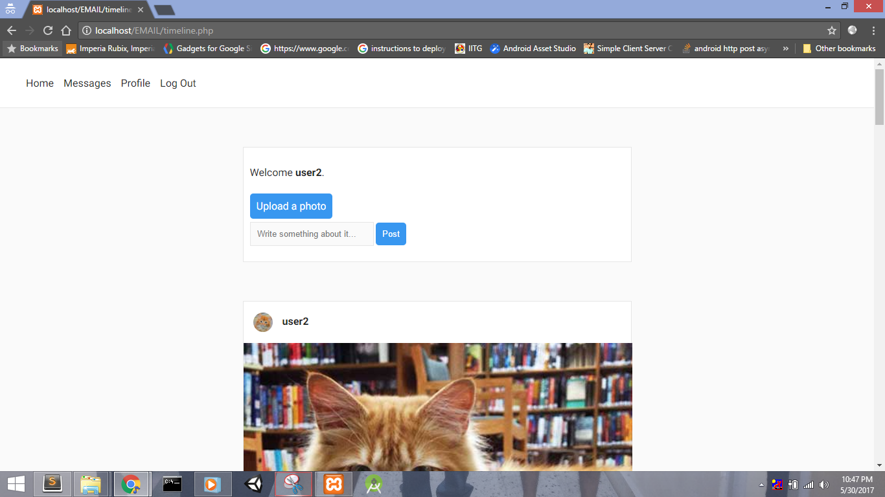
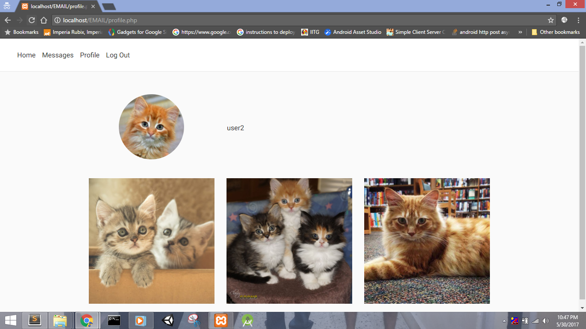

# Introduction
I made this project to learn PHP and explore the challenges of building a social networking website from scratch. Its an Instagram clone with all the basic features. Some features are yet to be added and there is a lot of scope for improvement in performance and scalability.

# Features
- Upload photos with descriptions
- View the profile of other users and follow them
- Timeline with pictures posted by users you follow
- Send text messages to other users
- Upvoting pictures in your timeline

# Features to be added
- Password encryption
- Message system works like an email, change it into real time chat
- Change database structure to improve performance in case of large number of users
- System for comments, replies to comments and upvotes to comments
- Group chats
- Allow files to be sent through messages

# Challenges
- Designing a database to store the data for efficient retrieval. The current structure will work very slowly if the number of users increase.
- Exploring various ways to store images
- Designing database for storing comments and replies in an efficient fashion

# Screenshots

# How to use
- Create a database named 'chatappdb' in your MySQL
- Start your server and run 'setup.php' to create the necessary tables
